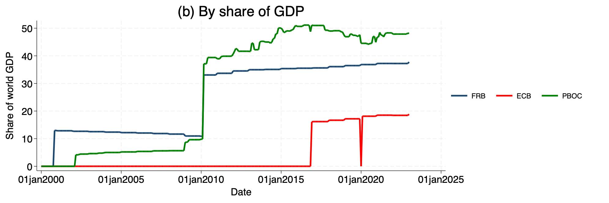
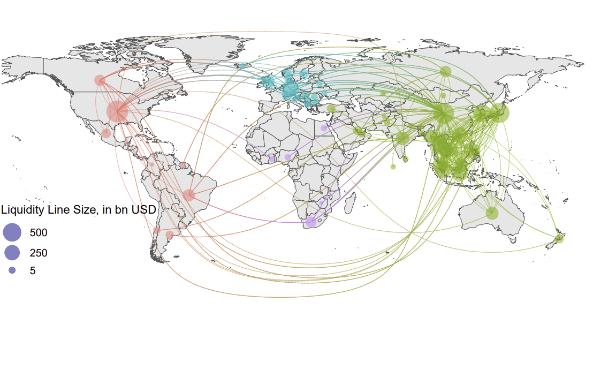

# Dataset for: The Global Network of Liquidity Lines

This is a test!

- [Draft, coming soon!](https://personal.lse.ac.uk/reisr/papers/99-infdis.pdf)

## Authors:

- [Saleem Bahaj](https://sites.google.com/site/saleembahaj/home)
- [Marie Fuchs](https://www.lse.ac.uk/economics/people/research-students/marie-fuchs)
- [Ricardo Reis](https://www.r2rsquared.com/)

## Date:

April 2024

## Summary
- A central bank cross-border liquidity line is an agreement between two central banks to
provide a collateralised loan of currency from one to the other. They have been around for
a long time, but have risen in prominence over the last twenty years. Following both the
great financial crisis and the pandemic, central banks expanded the number of lines and
relied on them to restore financial stability. By 2023, the funds committed to the liquidity
lines were well above the lending capacity of the International Monetary Fund (IMF). 

- These agreements are varied in their signatories and in their characteristics. For instance, while swap lines get most of the attention, there are many repurchase agreements
as well. Also, while borrowing from a line usually means money issuance by one of the
central banks, there are some large lines that instead lend out existing USD central bank
reserves. Finally, the People’s Bank of China (PBoC) has many bilateral lines, while the
Federal Reserve (Fed)’s lines are concentrated in one large multilateral arrangement, and
the European Central Bank (ECB) has a mix in between.

- This paper provides a comprehensive dataset of central bank cross-border liquidity
lines at the agreement level: by date and duration (2000-23), by source currency (USD,
EUR, RMB, others), by type (bilateral or multilateral), by funding structure (pooled or
by individual bank), by counterparties (central banks), and by some terms (like the collateral). This dataset was collated from public sources, and is **freely available for other
researchers to use**. We use these data to establish three novel sets of facts.

## Dataset

Download:
- [Excel](liquidity_lines_current_v19_upload.xlsx)
- [csv](liquidity_lines_current_v19_upload.csv)
- [dta](data.dta)

Variable Description:

<table>
  <tr style="background-color: #d4f4d3;">
    <th style="border: 2px solid #68b684; padding: 8px;">Column</th>
    <th style="border: 2px solid #68b684; padding: 8px;">Description</th>
  </tr>
  <tr style="background-color: #f5f5f5;">
    <td style="border: 2px solid #68b684; padding: 8px;"><code>deal_ID</code></td>
    <td style="border: 2px solid #68b684; padding: 8px;">Unique ID for each row representing a deal</td>
  </tr>
  <tr style="background-color: #d4f4d3;">
    <td style="border: 2px solid #68b684; padding: 8px;"><code>deal_type</code></td>
    <td style="border: 2px solid #68b684; padding: 8px;">String indicating reciprocity type</td>
  </tr>
  <tr style="background-color: #f5f5f5;">
    <td style="border: 2px solid #68b684; padding: 8px;"><code>framework</code></td>
    <td style="border: 2px solid #68b684; padding: 8px;">String indicating if deal is part of larger framework agreement</td>
  </tr>
  <tr style="background-color: #d4f4d3;">
    <td style="border: 2px solid #68b684; padding: 8px;"><code>reciprocal_deal</code></td>
    <td style="border: 2px solid #68b684; padding: 8px;">If deal is reciprocal, numeric value indicating matching reciprocal deal</td>
  </tr>
  <tr style="background-color: #f5f5f5;">
    <td style="border: 2px solid #68b684; padding: 8px;"><code>collaterepoal</code></td>
    <td style="border: 2px solid #68b684; padding: 8px;">String indicating type of collateral underlying each deal</td>
  </tr>
  <tr style="background-color: #d4f4d3;">
    <td style="border: 2px solid #68b684; padding: 8px;"><code>ISO_source</code></td>
    <td style="border: 2px solid #68b684; padding: 8px;">Source country ISO 3166-1 (alpha-3) country code</td>
  </tr>
  <tr style="background-color: #f5f5f5;">
    <td style="border: 2px solid #68b684; padding: 8px;"><code>source_country</code></td>
    <td style="border: 2px solid #68b684; padding: 8px;">Source country name</td>
  </tr>
  <tr style="background-color: #d4f4d3;">
    <td style="border: 2px solid #68b684; padding: 8px;"><code>ISO_recipient</code></td>
    <td style="border: 2px solid #68b684; padding: 8px;">Recipient country ISO 3166-1 (alpha-3) country code</td>
  </tr>
  <tr style="background-color: #f5f5f5;">
    <td style="border: 2px solid #68b684; padding: 8px;"><code>recipient_country</code></td>
    <td style="border: 2px solid #68b684; padding: 8px;">Recipient country name</td>
  </tr>
  <tr style="background-color: #d4f4d3;">
    <td style="border: 2px solid #68b684; padding: 8px;"><code>start_date</code></td>
    <td style="border: 2px solid #68b684; padding: 8px;">Agreement signature date or press release date</td>
  </tr>
  <tr style="background-color: #f5f5f5;">
    <td style="border: 2px solid #68b684; padding: 8px;"><code>end_date</code></td>
    <td style="border: 2px solid #68b684; padding: 8px;">Agreed expiration date as mentioned in press release</td>
  </tr>
  <tr style="background-color: #d4f4d3;">
    <td style="border: 2px solid #68b684; padding: 8px;"><code>existence_previous_deal</code></td>
    <td style="border: 2px solid #68b684; padding: 8px;">Indicator variable for whether a deal of any kind existed between the two countries in the past</td>
  </tr>
  <tr style="background-color: #f5f5f5;">
    <td style="border: 2px solid #68b684; padding: 8px;"><code>deal_action</code></td>
    <td style="border: 2px solid #68b684; padding: 8px;">String variable indicating the role of each deal within a deal chain</td>
  </tr>
  <tr style="background-color: #d4f4d3;">
    <td style="border: 2px solid #68b684; padding: 8px;"><code>previous_deal</code></td>
    <td style="border: 2px solid #68b684; padding: 8px;">(Backward-looking) if deal_action renew or reactivate, previous_deal indicates prior deal of identical characteristics being renewed or reactivated</td>
  </tr>
  <tr style="background-color: #f5f5f5;">
    <td style="border: 2px solid #68b684; padding: 8px;"><code>currency_of_deal</code></td>
    <td style="border: 2px solid #68b684; padding: 8px;">Agreed currency of the deal (ISO4217 standard abbreviation)</td>
  </tr>
  <tr style="background-color: #d4f4d3;">
    <td style="border: 2px solid #68b684; padding: 8px;"><code>source_currency</code></td>
    <td style="border: 2px solid #68b684; padding: 8px;">Source central bank currency (ISO4217 standard abbreviation)</td>
  </tr>
  <tr style="background-color: #f5f5f5;">
    <td style="border: 2px solid #68b684; padding: 8px;"><code>source_currency_deal</code></td>
    <td style="border: 2px solid #68b684; padding: 8px;">Dummy variable</td>
  </tr>
  <tr style="background-color: #d4f4d3;">
    <td style="border: 2px solid #68b684; padding: 8px;"><code>deal_currency_amount</code></td>
    <td style="border: 2px solid #68b684; padding: 8px;">Quoted maximum amount agreed on in currency of the deal; registered in billion as mentioned in press release</td>
  </tr>
  <tr style="background-color: #f5f5f5;">
    <td style="border: 2px solid #68b684; padding: 8px;"><code>USD_amount</code></td>
    <td style="border: 2px solid #68b684; padding: 8px;">If deal amount mentioned in USD in press release, then USD maximum amount, otherwise NA</td>
  </tr>
  <tr style="background-color: #d4f4d3;">
    <td style="border: 2px solid #68b684; padding: 8px;"><code>unlimited</code></td>
    <td style="border: 2px solid #68b684; padding: 8px;">Indicator variable for whether deal amount was unlimited</td>
  </tr>
  <tr style="background-color: #f5f5f5;">
    <td style="border: 2px solid #68b684; padding: 8px;"><code>initiative</code></td>
    <td style="border: 2px solid #68b684; padding: 8px;">Initiative under which deal was agreed (if any)</td>
  </tr>
</table>

## Figures

## The evolution over time of the liquidity lines

hgj
 

## The evolution over time of the liquidity lines, by currency

 

## Geographical coverage of the liquidity lines

## Updates

This research is updated regularly to reflect the latest data and analysis.

## Acknowledgment

We thank Marina Feliciano, and other people who helped!

---

*This website is for test purposes for Ricardo and the team.*
