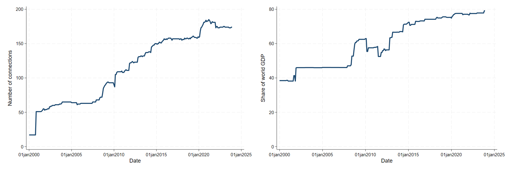

.
# Summary
A central bank cross-border liquidity line is an agreement between two central banks to provide a collateralised loan of currency from one to the other. They have been around for
a long time, but have risen in prominence since the globla financial crisis. This dataset provides a comprehensive (to the best of our knolwedge and ability) repository for all lines in place since 2000. This dataset was collated from public sources, so it can be **freely used** by other researchers.

The dataset will be updated regularly to reflect the latest data.
- **Vintage 1:** The dataset was last updated in April 2024 to cover lines in place until December 2023. 

---

# Authors and Reference:
[The Global Network of Liquidity Lines](https://personal.lse.ac.uk/reisr/papers/99-lines.pdf) (2024), CEPR discussion paper XXXX, 
[bibtex](https://personal.lse.ac.uk/reisr/papers/99-lines-bib.bib)
- [Saleem Bahaj](https://sites.google.com/site/saleembahaj/home)
- [Marie Fuchs](https://www.lse.ac.uk/economics/people/research-students/marie-fuchs)
- [Ricardo Reis](https://www.r2rsquared.com/)
- Acknowledgments: Marina Feliciano, Seyed Mahdi Hosseini, and Xiaotong Wu provided excellent research assistance.

---

# Full Dataset
Download in three formats:
- [Excel](liquidity_lines_0524.xlsx) (with meta data)
- [csv](liquidity_lines_0524.csv)
- [dta](liquidity_lins_0524.dta)

---

# Variables
The data is at the agreement level: by date and duration (2000-23), by source currency (USD,EUR, RMB, others), by type (bilateral or multilateral), by funding structure (pooled or
by individual bank), by counterparties (central banks), and by some terms (like the collateral).

<table>
  <tr style="background-color: #d4f4d3;">
    <th style="border: 2px solid #68b684; padding: 8px;">Column</th>
    <th style="border: 2px solid #68b684; padding: 8px;">Description</th>
  </tr>
  <tr style="background-color: #f5f5f5;">
    <td style="border: 2px solid #68b684; padding: 8px;"><code>deal_ID</code></td>
    <td style="border: 2px solid #68b684; padding: 8px;">Unique ID for each row representing a deal</td>
  </tr>
  <tr style="background-color: #d4f4d3;">
    <td style="border: 2px solid #68b684; padding: 8px;"><code>deal_type</code></td>
    <td style="border: 2px solid #68b684; padding: 8px;">String indicating reciprocity type</td>
  </tr>
  <tr style="background-color: #f5f5f5;">
    <td style="border: 2px solid #68b684; padding: 8px;"><code>framework</code></td>
    <td style="border: 2px solid #68b684; padding: 8px;">String indicating if deal is part of larger framework agreement</td>
  </tr>
  <tr style="background-color: #d4f4d3;">
    <td style="border: 2px solid #68b684; padding: 8px;"><code>reciprocal_deal</code></td>
    <td style="border: 2px solid #68b684; padding: 8px;">If deal is reciprocal, numeric value indicating matching reciprocal deal</td>
  </tr>
  <tr style="background-color: #f5f5f5;">
    <td style="border: 2px solid #68b684; padding: 8px;"><code>collaterepoal</code></td>
    <td style="border: 2px solid #68b684; padding: 8px;">String indicating type of collateral underlying each deal</td>
  </tr>
  <tr style="background-color: #d4f4d3;">
    <td style="border: 2px solid #68b684; padding: 8px;"><code>ISO_source</code></td>
    <td style="border: 2px solid #68b684; padding: 8px;">Source country ISO 3166-1 (alpha-3) country code</td>
  </tr>
  <tr style="background-color: #f5f5f5;">
    <td style="border: 2px solid #68b684; padding: 8px;"><code>source_country</code></td>
    <td style="border: 2px solid #68b684; padding: 8px;">Source country name</td>
  </tr>
  <tr style="background-color: #d4f4d3;">
    <td style="border: 2px solid #68b684; padding: 8px;"><code>ISO_recipient</code></td>
    <td style="border: 2px solid #68b684; padding: 8px;">Recipient country ISO 3166-1 (alpha-3) country code</td>
  </tr>
  <tr style="background-color: #f5f5f5;">
    <td style="border: 2px solid #68b684; padding: 8px;"><code>recipient_country</code></td>
    <td style="border: 2px solid #68b684; padding: 8px;">Recipient country name</td>
  </tr>
  <tr style="background-color: #d4f4d3;">
    <td style="border: 2px solid #68b684; padding: 8px;"><code>start_date</code></td>
    <td style="border: 2px solid #68b684; padding: 8px;">Agreement signature date or press release date</td>
  </tr>
  <tr style="background-color: #f5f5f5;">
    <td style="border: 2px solid #68b684; padding: 8px;"><code>end_date</code></td>
    <td style="border: 2px solid #68b684; padding: 8px;">Agreed expiration date as mentioned in press release</td>
  </tr>
  <tr style="background-color: #d4f4d3;">
    <td style="border: 2px solid #68b684; padding: 8px;"><code>existence_previous_deal</code></td>
    <td style="border: 2px solid #68b684; padding: 8px;">Indicator variable for whether a deal of any kind existed between the two countries in the past</td>
  </tr>
  <tr style="background-color: #f5f5f5;">
    <td style="border: 2px solid #68b684; padding: 8px;"><code>deal_action</code></td>
    <td style="border: 2px solid #68b684; padding: 8px;">String variable indicating the role of each deal within a deal chain</td>
  </tr>
  <tr style="background-color: #d4f4d3;">
    <td style="border: 2px solid #68b684; padding: 8px;"><code>previous_deal</code></td>
    <td style="border: 2px solid #68b684; padding: 8px;">(Backward-looking) if deal_action renew or reactivate, previous_deal indicates prior deal of identical characteristics being renewed or reactivated</td>
  </tr>
  <tr style="background-color: #f5f5f5;">
    <td style="border: 2px solid #68b684; padding: 8px;"><code>currency_of_deal</code></td>
    <td style="border: 2px solid #68b684; padding: 8px;">Agreed currency of the deal (ISO4217 standard abbreviation)</td>
  </tr>
  <tr style="background-color: #d4f4d3;">
    <td style="border: 2px solid #68b684; padding: 8px;"><code>source_currency</code></td>
    <td style="border: 2px solid #68b684; padding: 8px;">Source central bank currency (ISO4217 standard abbreviation)</td>
  </tr>
  <tr style="background-color: #f5f5f5;">
    <td style="border: 2px solid #68b684; padding: 8px;"><code>source_currency_deal</code></td>
    <td style="border: 2px solid #68b684; padding: 8px;">Dummy variable if deal and source are same currency</td>
  </tr>
  <tr style="background-color: #d4f4d3;">
    <td style="border: 2px solid #68b684; padding: 8px;"><code>deal_currency_amount</code></td>
    <td style="border: 2px solid #68b684; padding: 8px;">Quoted maximum amount agreed on in currency of the deal; registered in billion as mentioned in press release</td>
  </tr>
  <tr style="background-color: #f5f5f5;">
    <td style="border: 2px solid #68b684; padding: 8px;"><code>USD_amount</code></td>
    <td style="border: 2px solid #68b684; padding: 8px;">If deal amount mentioned in USD in press release, then USD maximum amount, otherwise NA</td>
  </tr>
  <tr style="background-color: #d4f4d3;">
    <td style="border: 2px solid #68b684; padding: 8px;"><code>unlimited</code></td>
    <td style="border: 2px solid #68b684; padding: 8px;">Indicator variable for whether deal amount was unlimited</td>
  </tr>
  <tr style="background-color: #f5f5f5;">
    <td style="border: 2px solid #68b684; padding: 8px;"><code>initiative</code></td>
    <td style="border: 2px solid #68b684; padding: 8px;">Initiative under which deal was agreed (if any)</td>
  </tr>
</table>

---

# Latest Figures (as of 2023)

## Geographical coverage of the liquidity lines

Data for replication: [Excel](Map_network.xlsx), [csv](Map_network.csv), [dta](Map_network.dta) 

---

## Geographical coverage of the USD liquidity lines by degree

Data for replication: [Excel](/network_bilateral2023_USA.xlsx), [csv](/network_bilateral2023_USA.csv), [dta](/network_bilateral2023_USA.dta) 

---

## Geographical coverage of the EUR liquidity lines by degree

Data for replication: [Excel](network_bilateral2023_EA.xlsx), [csv](network_bilateral2023_EA.csv), [dta](network_bilateral2023_EA.dta) 

---

## Geographical coverage of the RMB liquidity lines by degree

Data for replication: [Excel](network_bilateral2023_CHN.xlsx), [csv](network_bilateral2023_CHN.csv), [dta](network_bilateral2023_CHN.dta) 

---

## The evolution over time of the liquidity lines

Data for replication: [Excel](combined_TotalConnections.xlsx), [csv](combined_TotalConnections.csv), [dta](combined_TotalConnections.dta) 

---

## The evolution over time of the USD liquidity lines 
 
Data for replication: [Excel](bilateral_USAcoverage_GDP.xlsx), [csv](bilateral_USAcoverage_GDP.csv), [dta](bilateral_USAcoverage_GDP.dta) 

---

## The evolution over time of the EUR liquidity lines 
 
Data for replication: [Excel](bilateral_EAcoverage_GDP.xlsx), [csv](bilateral_EAcoverage_GDP.csv), [dta](bilateral_EAcoverage_GDPdta) 

---

## The evolution over time of the RMB liquidity lines 
 
Data for replication: [Excel](bilateral_CHNcoverage_GDP.xlsx), [csv](bilateral_CHNcoverage_GDP.csv), [dta](bilateral_CHNcoverage_GDP.dta) 

---

# Usage
Please cite if use, and e-mail the authors with suggested corrections.

